# Telegram Drive

Telegram Drive is a cross-platform file manager for using your Telegram account as a personal cloud drive. It provides a desktop-style workspace over Saved Messages and Telegram channels, with uploads, downloads, folders, previews, streaming, sharing tools, a local REST API, themes, localization, and an opt-in encrypted-transfer mode.

The application is built with Tauri, Rust, React, and TypeScript.

<div align="center">
http://telegram-drive.com
</div>

<br>


<div align="center">

[]()

[](https://oosmetrics.com/repo/caamer20/Telegram-Drive)
[](https://oosmetrics.com/repo/caamer20/Telegram-Drive)
[](https://oosmetrics.com/repo/caamer20/Telegram-Drive)

</div>

## How Telegram Drive works

Telegram Drive connects directly to Telegram with API credentials supplied by the user. Saved Messages acts as the home location, while Telegram channels created or selected by the app can be presented as folders. Files are still subject to Telegram account, service, and per-file limits; Telegram Drive does not provide literally unlimited storage.

The current application policy caps a Telegram object at approximately **2,000,000,000 bytes**. An encrypted file has additional envelope overhead, so its maximum original plaintext size is slightly lower.

## Features

### File workspace and organization

- Grid and list views with virtualized rendering for large folders.
- Responsive file cards with adjustable sizing from **50% to 200%**.
- Search, sorting, multi-select, range selection, and bulk actions.
- Upload, download, rename, move, copy, and delete workflows where supported by Telegram.
- Drag-and-drop uploads and internal drag-and-drop file organization.
- Folder creation, rename, deletion, visibility controls, and local custom folder groups.
- Entire-folder upload with optional ZIP creation before transfer.
- Remote URL uploads with progress, cancellation, retry, and resumable range support when the source server allows it.
- Persistent transfer queues and a compact transfer center for upload/download status.

### Viewing, playback, and archives

- Inline image and media thumbnails with lazy loading.
- Faster repeat image opens through bounded in-memory and on-disk preview caches, request deduplication, skeleton states, and asynchronous image decoding.
- Built-in image preview, PDF reader, audio player, and video streaming.
- Video streaming and remux/transcode support for compatible plaintext media.
- ZIP, RAR, and 7z archive browsing and extraction, including extraction back into Telegram Drive.

These viewers currently operate on standard, unencrypted files. See [Encryption mode](#encryption-mode-opt-in-alpha) for encrypted-file restrictions.

### Modern interface and themes

- The 2.0.0 **Quiet Utility** redesign uses a compact, content-first desktop and mobile visual system with calmer surfaces, smaller controls, clearer hierarchy, and restrained motion.
- Aligned desktop toolbar/sidebar chrome, a collapsible bounded sidebar, responsive settings navigation, and polished authentication, viewer, empty, loading, error, and selection states.
- **Default**, **System**, **Light**, and **Dark** appearance modes.
- Built-in color presets plus a custom-theme editor for creating, editing, saving, activating, and deleting user themes.
- Existing stored themes are adapted to the new semantic design tokens.
- Reduced-motion and interface performance preferences remain available.

### Sharing and local integrations

- Local download links for standard files with optional password protection, expiration, listing, and revocation.
- Native Telegram message links for files in public channels.
- A desktop REST API that is **off by default**, binds to `127.0.0.1`, uses a configurable port, and requires an `X-API-Key` header for protected routes.
- REST operations for files, folders, bulk actions, storage statistics, duplicates, empty folders, thumbnails, and media metadata.
- Desktop WebDAV access that is **off by default**, loopback-only, read-only by default, protected by a one-time capability link, and available on a user-selected port.

> [!NOTE]
> Telegram Drive share links are served by the running desktop app at a loopback address. They are not public, hosted internet links. See the [WebDAV guide](WEBDAV_GUIDE.md) and the human-readable [REST API endpoint reference](REST_API_Documentation.md). The repository does not currently contain a generated OpenAPI document.

### Network and platform support

- Telegram authentication through phone/code or QR login, with cloud-password support when two-factor authentication is enabled.
- SOCKS5 proxy configuration plus HTTP/HTTPS proxy routing through the application's local bridge.
- VPN-oriented timeout, retry, keep-alive, polling, bandwidth, chunk-size, and archive-limit controls.
- Desktop updater support for Windows, macOS, and Linux using signed Tauri updater artifacts.
- Desktop builds for Windows, Linux, macOS Intel, and macOS Apple Silicon.
- Android support with touch-oriented navigation, the Android share sheet, foreground transfers, native file publication, and Android API 24+ configuration.

### Optional Lifetime Ad-Free Supporter License

Telegram Drive has no feature tiers: every user has access to every application feature. The desktop app offers an optional **$5 USD Lifetime Ad-Free Supporter License** that removes sponsor placements on up to three desktop devices with one verified PayPal payment. There is no subscription or recurring charge. Start checkout only from **Settings → Privacy → Supporter**. The app creates no supporter email profile: activation uses PayPal transaction identifiers, a random entitlement, and device cryptographic keys. Normal app updates reuse the same operating-system credential and do not require reactivation; reinstalling or activating another device requires the recovery code and is subject to the three-device limit.

> [!WARNING]
> Payment alone does not bypass verification. Save the recovery code shown after activation. Refunds are not automatic and are not guaranteed except where required by law. A refund, payment reversal, chargeback, or upheld dispute revokes the associated ad-free entitlement. Read the [Supporter Terms](SUPPORTER_TERMS.md) before paying.

## Encryption mode (opt-in alpha)

Version 2.0.0 includes client-side encrypted transfers using the versioned **TDENC2** envelope. Standard uploads remain the default, and users can turn encryption on or off for future uploads from Settings or choose protection for an individual upload.

### Upload protection modes

| Mode | Protection | Unlock requirement |
| --- | --- | --- |
| Standard | Existing plaintext Telegram upload | None |
| Vault | Encrypts with a key held in the local encrypted vault | The vault must be unlocked |
| File passphrase | Adds a passphrase slot to that file | The file passphrase |
| Vault + file passphrase | Adds both vault and per-file passphrase access | A valid supported slot |

The implementation provides:

- Streaming XChaCha20-Poly1305 encryption before upload to Telegram.
- Streaming authenticated decryption on download, with a protected partial file published only after verification succeeds.
- Optional authenticated protection for the original filename and MIME type.
- A persistent local vault protected by a user passphrase.
- Manual lock/unlock, inactivity auto-lock, background/sleep lock, logout lock, and exit lock.
- Vault passphrase changes and authenticated recovery-bundle export/import.
- Per-file encryption status badges and protected-name behavior on desktop and mobile.
- Encryption coverage for file-picker uploads, drag-and-drop, folder ZIPs, Android shared files, retries, and remote URL uploads.
- Short-lived passphrase prompt tokens; raw file passphrases are not persisted in transfer queues.

### Encryption safety notice

> [!CAUTION]
> **Telegram Drive cannot recover, reset, or reconstruct a lost vault passphrase, file passphrase, encryption key, or unusable recovery bundle.** You are responsible for securely recording your credentials, protecting and testing recovery material, and keeping an independent backup of important files. Lost credentials, damaged recovery material, incorrect settings, or other encryption misuse can make data permanently unrecoverable. To the extent permitted by law, the project and its contributors are not responsible for data loss or other consequences resulting from the use or misuse of encryption features.

The encryption design and implementation have **not received an independent security audit**. Use isolated test data first and do not treat this alpha as a substitute for a tested backup strategy.

### Current encrypted-file limitations

The following operations intentionally fail closed for encrypted objects; their existing behavior for standard files is unchanged:

- In-app image, PDF, archive, audio, and video previews.
- Encrypted thumbnails, range streaming, HLS/fMP4 playback, and transcoding.
- Local plaintext share links and REST/local-server plaintext access.
- Remote rename of encrypted Telegram media.
- Plaintext-to-encrypted migration, decrypt-in-place migration, rekey/slot-management UI, and full format migration.

Download and authenticate an encrypted file before opening it with another application. See the [TDENC2 architecture decision](app/docs/adr/ADR-0002-encrypted-file-envelope-v2.md) and [encryption execution report](ENCRYPTION_REMEDIATION_EXECUTION_REPORT.md) for format, verification, and rollout details.

## Languages

Telegram Drive supports a **System** language preference and these 24 selectable production locales:

- English
- Spanish
- Russian
- Ukrainian
- Polish
- Persian
- Urdu
- Malay
- Simplified Chinese
- Traditional Chinese
- French
- Italian
- Arabic
- Brazilian Portuguese
- German
- Hindi
- Bengali (Bangladesh)
- Indonesian
- Filipino (Philippines)
- Turkish
- Thai (Thailand)
- Japanese
- Korean
- Vietnamese

The 2.0.0 localization infrastructure includes locale alias resolution, locale-aware number/date/size/rate formatting, right-to-left document direction for Arabic, Persian, and Urdu, bidirectional-text safety helpers, typed translation keys, interpolation validation, pseudo-locales, literal scanning, and CI checks.

Localization is still being completed: some non-English entries currently fall back to or duplicate English, some UI literals remain to be extracted, and the full native-language, RTL, long-string, CJK, accessibility, and legal-copy review is not finished. The locale list therefore describes supported language selection, not a claim that every screen has completed native linguistic review. Track the remaining work in the [language support implementation plan](LANGUAGE_SUPPORT_IMPLEMENTATION_PLAN.md).

## Data and privacy

- Telegram API credentials, session data, settings, transfer state, encryption registry data, and vault material are stored locally in the application's data directories.
- Standard uploads send file content to Telegram in its normal form. TDENC2 uploads send ciphertext; Telegram can still observe transport and account metadata such as ciphertext size, time, account, and destination channel.
- File transfers go directly between the application and Telegram; the project does not operate a separate file-relay service.
- The optional REST API binds only to loopback and stores only a hash of its generated API key. The plaintext API key is shown when generated and cannot be retrieved later.
- Local share links depend on the app's local streaming server and the app remaining open and connected.
- A configured proxy routes traffic according to the selected proxy settings. Review and trust your own proxy provider.
- Optional ad-free activation contacts the Telegram Drive supporter verification service. It stores no purchaser email and receives no Telegram credentials or file activity; see the [Privacy Policy](PRIVACY.md) and [Supporter Terms](SUPPORTER_TERMS.md).

## Android beta (pre-built unsigned APK)

A pre-built **unsigned Android beta APK** is available from the [Telegram Drive v3.0.0 beta release](https://github.com/caamer20/Telegram-Drive/releases/tag/Androidv4.0.0beta).

> [!WARNING]
> The APK is not signed and is not distributed through Google Play. Installing an unsigned sideloaded build carries additional authenticity and update risks.

### Sideloading

1. Download `Telegram-Drive-v4.0.0-beta.apk` from the [Android beta release](https://github.com/caamer20/Telegram-Drive/releases/tag/Androidv4.0.0beta).
2. On Android, open **Settings → Apps → Special app access → Install unknown apps** and grant permission to the browser or file manager used for the APK.
3. Open the APK and choose **Install**.
4. Enter your own Telegram API ID and API hash on first launch.

Compatibility notes:

- The current Android project has `minSdk 24`, corresponding to Android 7.0 or newer.
- The pre-built Android release is a separate community/beta track from the primary desktop releases.
- On devices that block the beta because of target-SDK policy, advanced users can attempt installation with ADB:

  ```bash
  adb install --bypass-low-target-sdk-block Telegram-Drive-v2.1.5-beta.apk
  ```

## Screenshots

> [!NOTE]
> These images document the currently published desktop and Android builds. They do not yet show every part of the unreleased 2.0.0 Quiet Utility redesign.

### Desktop

| Dashboard | File preview |
| --- | --- |
| 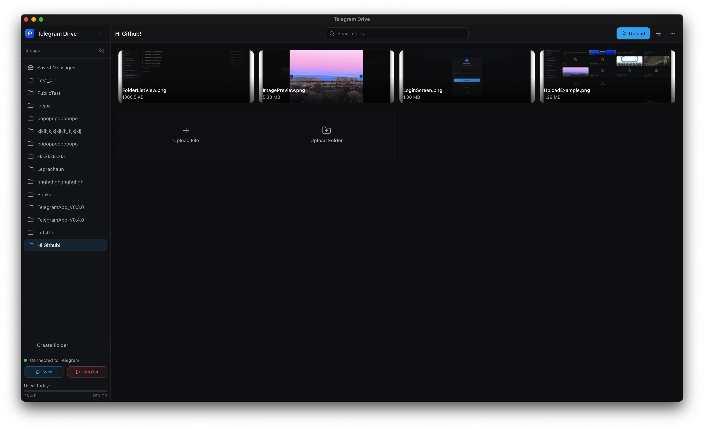 | 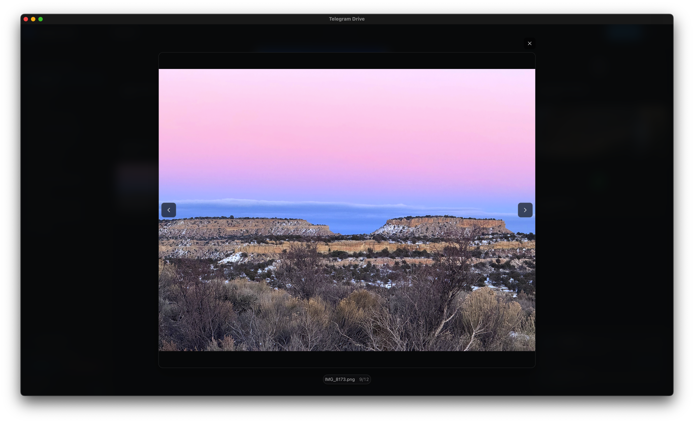 |

| Grid view | Authentication |
| --- | --- |
| 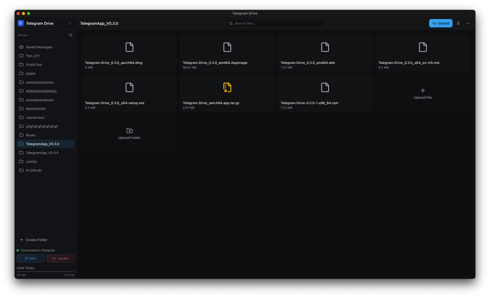 | 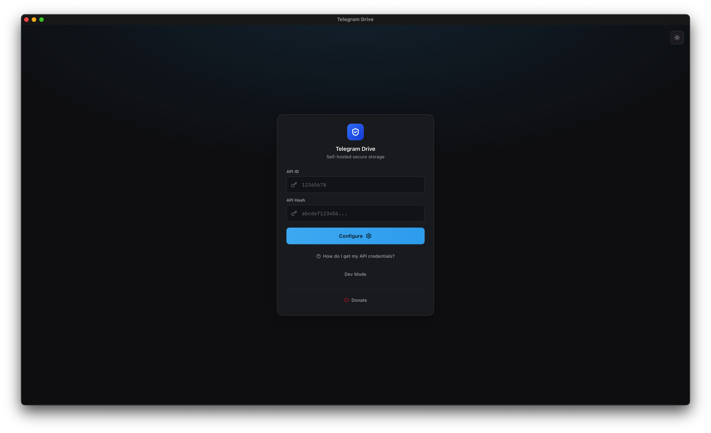 |

| Audio playback | Video playback |
| --- | --- |
| 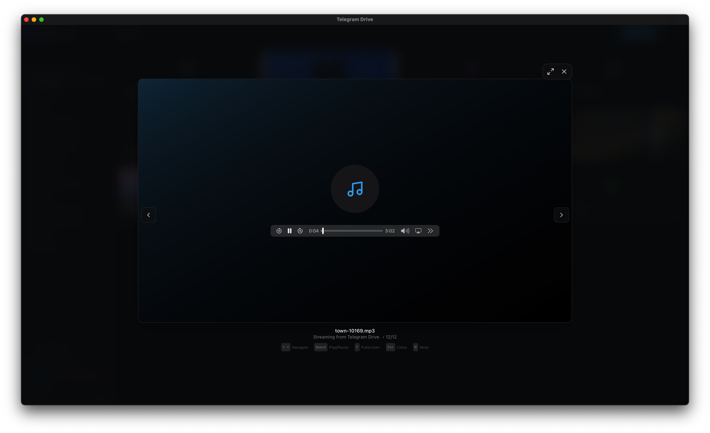 | 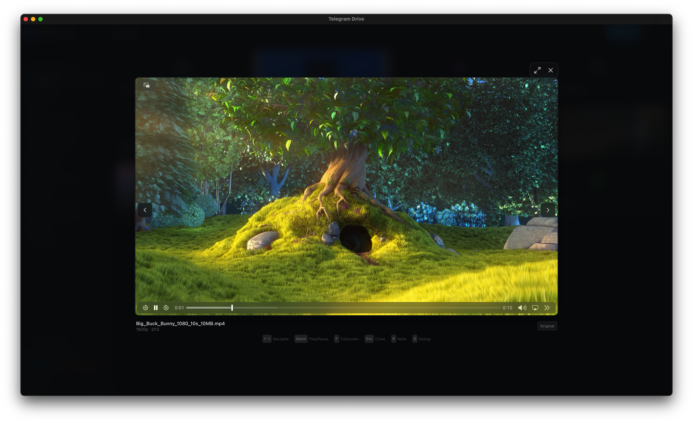 |

| Folder creation | Folder list |
| --- | --- |
| 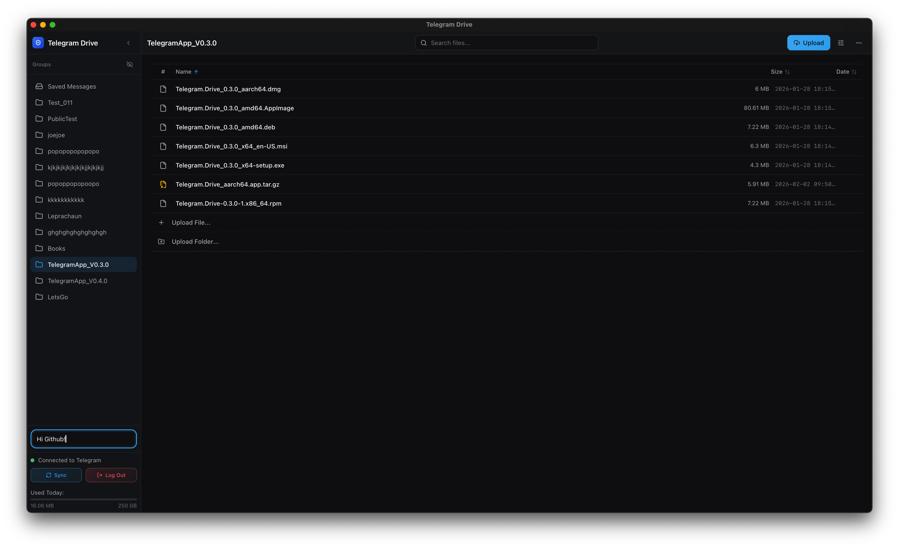 | 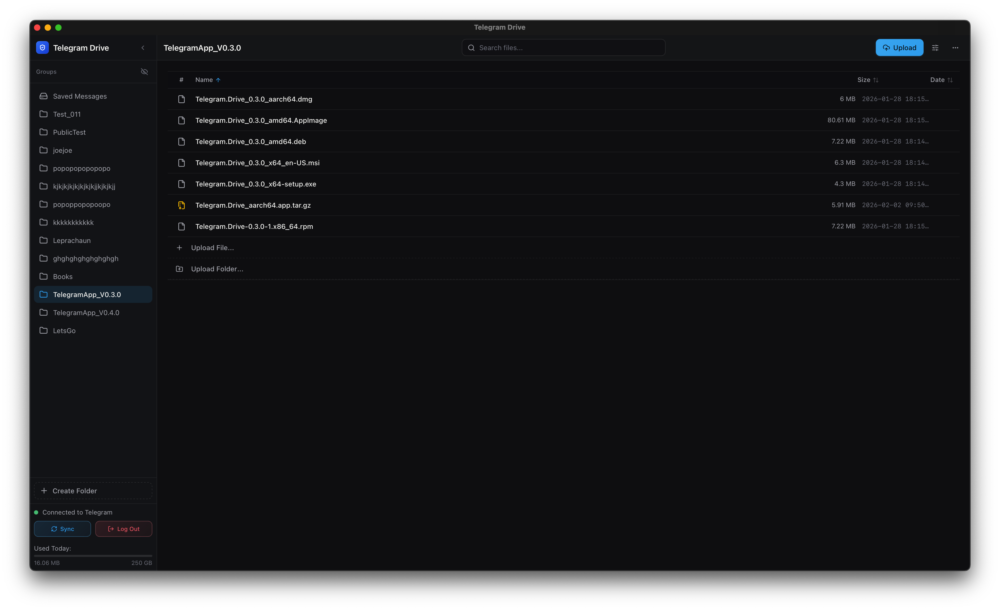 |

### Android

| Home | Splash | Dark folder view |
| --- | --- | --- |
| 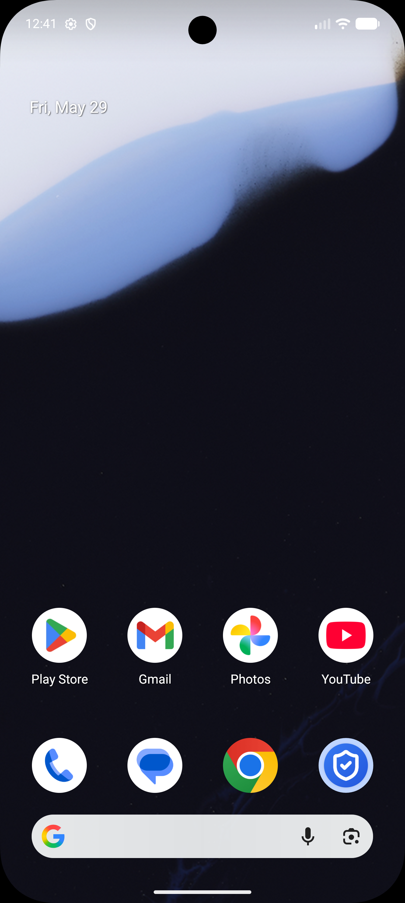 |  | 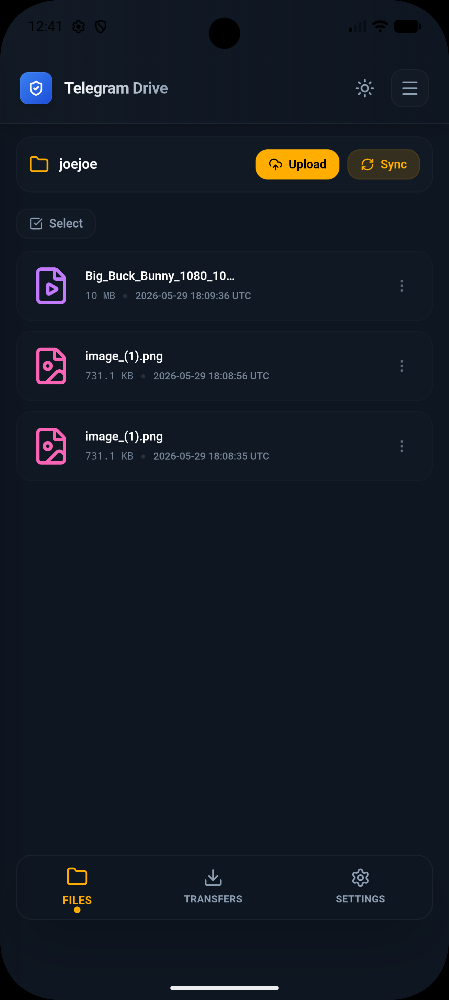 |

| Folder list | Transfer queue | Settings |
| --- | --- | --- |
|  | 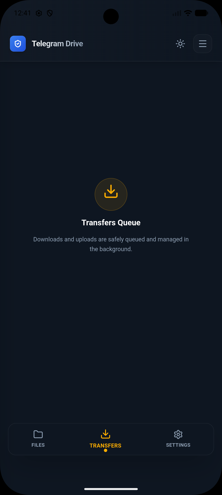 | 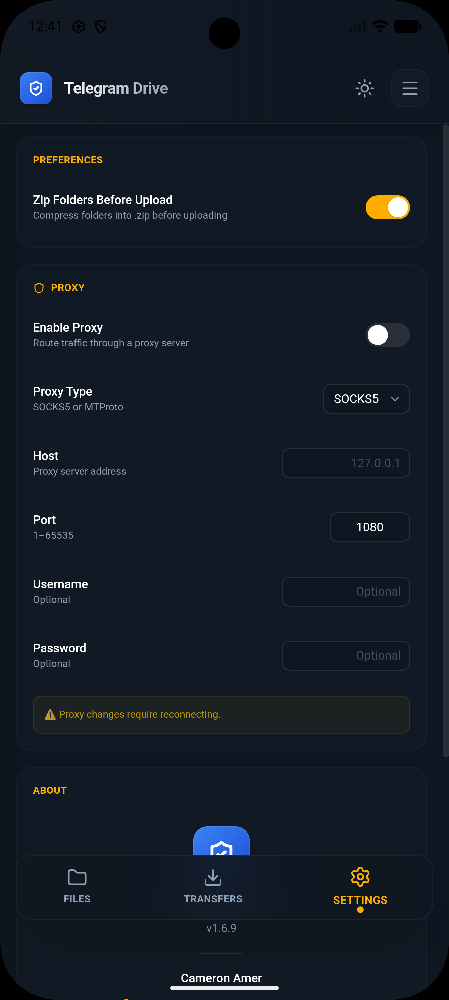 |

## Technology

- **Frontend:** React 19, TypeScript, Tailwind CSS 4, Framer Motion, TanStack Query, and TanStack Virtual.
- **Desktop/mobile shell:** Tauri 2.
- **Backend:** Rust, Grammers Telegram client, SQLite, Tokio, and Actix Web.
- **Media and documents:** PDF.js, HLS.js, MP4Box, and Rust media/archive helpers.
- **Build tooling:** Vite 7 and Cargo.

## Build from source

### Prerequisites

- **Node.js:** `20.19.0+` within Node 20, or `22.12.0+`. These are the engine ranges required by the installed Vite 7 toolchain.
- **Rust:** Latest stable toolchain installed with [rustup](https://rustup.rs/).
- **Telegram API credentials:** Create an application under **API development tools** at [my.telegram.org](https://my.telegram.org) to obtain your own `api_id` and `api_hash`.
- **Tauri platform prerequisites:** Follow the [Tauri 2 prerequisites guide](https://v2.tauri.app/start/prerequisites/) for the operating system being used.

Common platform requirements:

- **macOS:** Xcode Command Line Tools (`xcode-select --install`).
- **Windows:** Visual Studio Build Tools with **Desktop development with C++**, plus the Microsoft Edge WebView2 Runtime if it is not already installed.
- **Ubuntu/Debian:** The CI build currently installs:

  ```bash
  sudo apt-get update
  sudo apt-get install -y libwebkit2gtk-4.1-dev build-essential curl wget file \
    libssl-dev libgtk-3-dev libayatana-appindicator3-dev librsvg2-dev libfuse2
  ```

### Install and run

```bash
git clone https://github.com/caamer20/Telegram-Drive.git
cd Telegram-Drive/app
npm install
npm run tauri dev
```

The first Tauri run downloads and compiles the Rust dependency graph and can take several minutes. Later builds reuse Cargo's compilation cache.

Build release bundles with:

```bash
cd app
npm run tauri build
```

On Windows, this command automatically downloads and validates Microsoft's signed Visual C++ Redistributable before creating the NSIS installer. The installer-only resource is deliberately excluded from `npm run tauri dev`, so development builds do not require a pre-downloaded `vc_redist.x64.exe`.

### Validation commands

Run these from `app/`:

```bash
npm run build
npm run i18n:check
cd src-tauri && cargo test --lib
```

`npm run i18n:check` validates locale structure, variables, generated key types, and scans for untranslated literals. It currently reports known localization-completeness warnings described in the language plan.

## Project documentation

- [Changelog](CHANGELOG.md)
- [Supporter terms](SUPPORTER_TERMS.md)
- [Supporter service operations](SUPPORTER_SERVICE.md)
- [REST API endpoint reference](REST_API_Documentation.md)
- [Quiet Utility implementation plan](QUIET_UTILITY_IMPLEMENTATION_PLAN.md)
- [Language support implementation plan](LANGUAGE_SUPPORT_IMPLEMENTATION_PLAN.md)
- [Encryption architecture plan](ENCRYPTION_MODE_IMPLEMENTATION_PLAN.md)
- [Encryption remediation plan](ENCRYPTION_REMEDIATION_IMPLEMENTATION_PLAN.md)
- [Encryption execution report](ENCRYPTION_REMEDIATION_EXECUTION_REPORT.md)
- [TDENC2 architecture decision](app/docs/adr/ADR-0002-encrypted-file-envelope-v2.md)

---

*Telegram Drive is not affiliated with Telegram FZ-LLC. Use it responsibly and in accordance with Telegram's terms and applicable laws.*

<div align="center">
  
**Want to support development and remove desktop ads?**  
Use the verified PayPal checkout in Settings → Privacy → Supporter. Direct tips and cryptocurrency donations do not activate ad-free access.
 
  <div style="margin: 15px 0;">
    <a href="litecoin:ltc1q6wkr5ac4u0pxx4hx7xgwn0gsaku25ws0df73rp">
      
    </a>
    <div style="font-family: monospace; font-size: 13px; margin-top: 8px; word-break: break-all;">
      ltc1q6wkr5ac4u0pxx4hx7xgwn0gsaku25ws0df73rp
    </div>
  </div>

  <div style="margin: 15px 0;">
    <a href="bitcoin:bc1q5pt7m2fk6w0dzsnf6vvd5k6nw5k44785286ujy">
      
    </a>
    <div style="font-family: monospace; font-size: 13px; margin-top: 8px; word-break: break-all;">
      bc1q5pt7m2fk6w0dzsnf6vvd5k6nw5k44785286ujy
    </div>
  </div>
</div>
